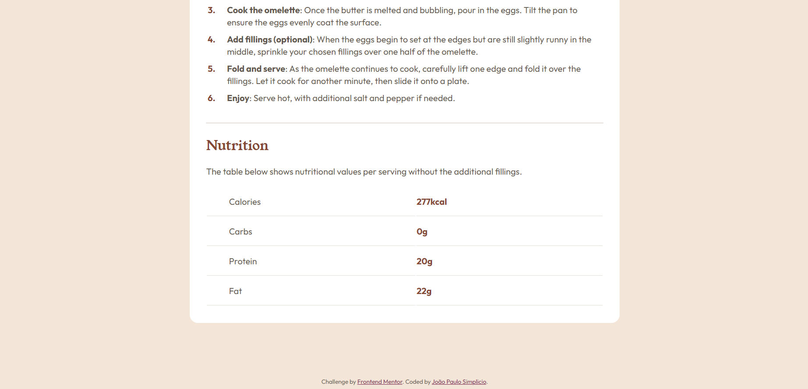

# Frontend Mentor - Recipe page solution

This is a solution to the [Recipe page challenge on Frontend Mentor](https://www.frontendmentor.io/challenges/recipe-page-KiTsR8QQKm). Frontend Mentor challenges help you improve your coding skills by building realistic projects.

## Table of contents

- [Overview](#overview)
  - [The challenge](#the-challenge)
  - [Screenshot](#screenshot)
  - [Links](#links)
- [My process](#my-process)
  - [Built with](#built-with)
  - [What I learned](#what-i-learned)
- [Author](#author)

## Overview

### The challenge

Reproduction of provided designs.

### Screenshot

    
    
    

### Links

- [Solution URL](https://github.com/simplicioJoao/frontend-mentor-recipe-page-main)
- [Live Site URL](https://simpliciojoao.github.io/frontend-mentor-recipe-page-main/)

## My process

### Built with

- Semantic HTML5 markup
- CSS custom properties
- Media queries

### What I learned

My main learning from this project was the use of media queries to make the page responsive.

## Author

- Frontend Mentor - [@simplicioJoao](https://www.frontendmentor.io/profile/simplicioJoao)
- GitHub - [@simplicioJoao](https://github.com/simplicioJoao)
- LinkedIn - [João Paulo Simplicio](https://www.linkedin.com/in/joão-paulo-simplicio-612bb025a)